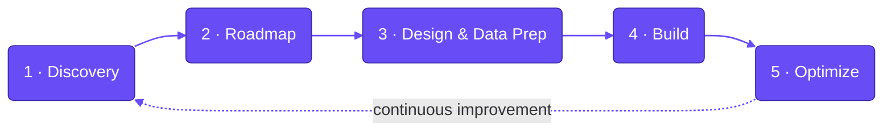
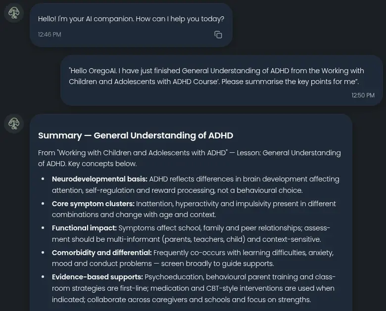

<!--
  GITHUB ORG PROFILE README
  Deployment: create a PUBLIC repo named exactly ".github" in your org,
  then place this file at  profile/README.md
  GitHub renders it automatically on your org landing page.

  Verify the org slug below matches your real GitHub org URL
  (github.com/<slug>). Wrong slug = broken stat cards.
-->

<!-- LOGO: commit the uploaded logo PNG to /profile/assests/logo.png (folder spelled "assests").
     Do NOT hotlink the /_next/image?url=... URL — it carries a deployment hash and breaks. -->

  

---

## About

UltreonAI is an Agentic AI design studio for Singapore businesses. We design and deploy AI systems that go into production and stay maintainable — not demos. Our work spans strategy, build, and deployment, with a focus on giving clients full ownership and control over their AI technology and data.

---

## What We Build

- **AI-Powered Websites** — intelligent sites that adapt to each visitor and drive conversions
- **Customer Engagement Support** — 24/7 support systems that nurture leads through personalized interactions
- **Inventory Management** — predictive analytics for demand forecasting, automated reordering, and stockout prevention
- **Sales Fulfillment Pipeline** — monitors, predicts, and optimizes the full pipeline from order validation to delivery

---

## How We Work

We optimize for clear, attainable objectives that deliver quick wins and measurable ROI, while keeping you in full control:

- **Strategic Roadmapping** — a step-by-step AI transformation plan aligned to your business goals
- **Tailor-Made Solutions** — custom-built systems for predictability, reliability, and transparency
- **Data Sovereignty** — 100% ownership of your AI technology and data
- **High-Impact ROI** — an operable framework built for fast, measurable returns

### Deployment that matches your needs

| Model | What it offers |
|---|---|
| **Cloud** | Flexible costs, faster ROI, instant scalability, low maintenance overhead |
| **Hybrid** | Flexibility where you need it, sensitive data kept secure on-premise |
| **Local / On-Premise** | In-house designed UltreonAI servers — complete data control, reliable performance, long-term asset ownership |

### Our process

---

## Tech Stack

**Frontend & Hosting**

**AI / LLM**

**Automation & Orchestration**

**Data, Infra & Tooling**

---

## Selected Work

A closer look at production AI systems we have delivered for real teams and institutions.

### OregoAI &nbsp;·&nbsp; `Live`

**Sector.** Healthcare / Education &nbsp;·&nbsp; **Built for** Orego

<!-- Optional screenshot — commit to /profile/assests/ -->

A professional-grade mental wellness companion that extends expert training into daily practice with trusted, human-centered AI coaching.

Developed for Orego Pte Ltd, a trusted provider of expert-led training working with institutions such as MOE, NUH, SGH, and MSF, OregoAI brings more than 300 years of combined clinical and caregiving expertise into everyday practice. Available 24/7, it offers clear, evidence-based guidance grounded in CBT, DBT, and mindfulness, along with practical coping strategies, structured skill practice, and thoughtful triage support.

---

<!-- Add public-repo pins here if/when you open-source anything:

-->

## Get In Touch

Tell us about your project and we'll get back to you within 24 hours.

- 🌐 **Website:** [ultreonai.com](https://www.ultreonai.com)
- 📧 **Email:** hello@ultreonai.com
- 💬 **WhatsApp:** [+65 8895 9962](https://wa.me/6588959962)
- 📍 **Office:** 27 Purvis Street #04-02, Singapore 188604

© 2026 UltreonAI · Agentic AI Design Studio

